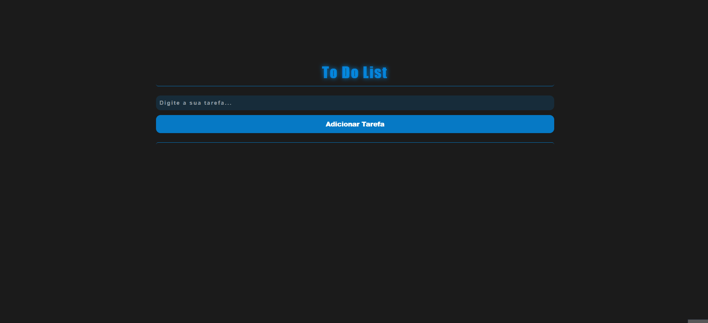

# To Do List Basic

## Acesse o projeto

- 🔗[Acesse Aqui o Projeto!](https://thasyo.github.io/toDoListBasic/)

#### Visualização do Projeto

## 📃 Descrição 📃

- Projeto simples e básico de uma "ToDoList", onde o objetivo é auxiliar o usuário em sua organização de tarefas e afazeres.

## 🛠️ Tecnologias 🛠️

- HTML
- CSS
- JAVASCRIPT
- GIT
- GITHUB
- VSCODE

## 👨‍💻 Experiência Pessoal 👨‍💻

- Neste projeto, pude exercitar e praticar o Vanilla JavaScript. 

- Desafios

    - Meu maior desafio foi implementar a função de remoção de tarefas; onde era necessário utilizar o HTML clonado para selecionar as partes específicas do HTML, e assim, fazer com que a funcionalidade de remoção de tarefas fosse executada perfeitamente.

- O motivo da criação deste projeto, foi a necessidade que existia na minha rotina de uma organização e separação de afazeres (confesso que durante o projeto refleti bastante sobre organização de tarefas hahaha).

## 🛑 Não pare por aqui! 🛑

- Gostou do meu projeto? Então me acompanhe no LinkedIn, para ficar por dentro das minhas últimas aplicações! 😉

- 🔗[Linkedin](https://www.linkedin.com/in/thasyo-peres-63aa27235/)
